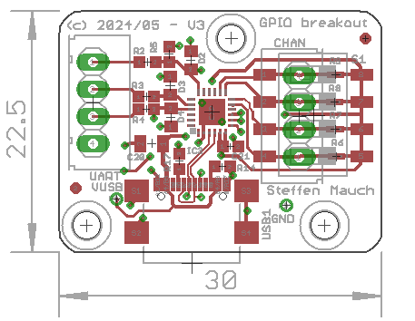

# CP2102N_GPIO_interface_board

SiLabs CP2102N based USB-to-serial board with option to use WS2812B LEDs and isolated input.
The four GPIOs of the CP2102N can be used for coding when using multiple devices in parallel or as individual inputs too.

Layout designed with Cadsoft Eagle v6.6

```*.emn and *.emp``` are IDF files e.g. for SolidWorks.




### License
[](https://www.gnu.org/licenses/lgpl-2.1)